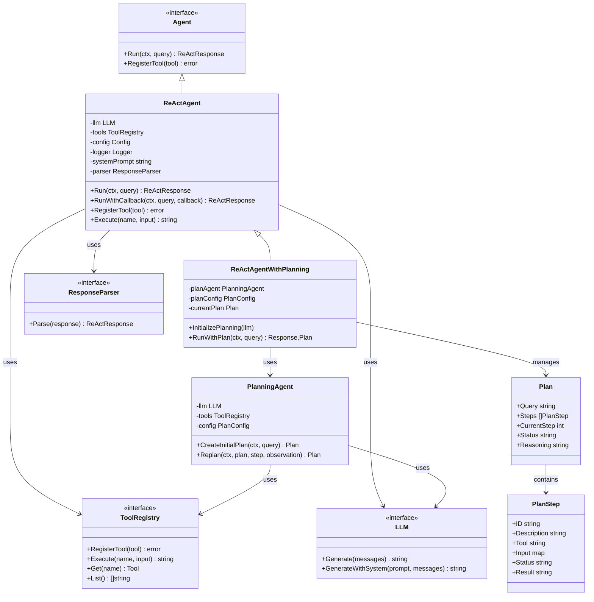
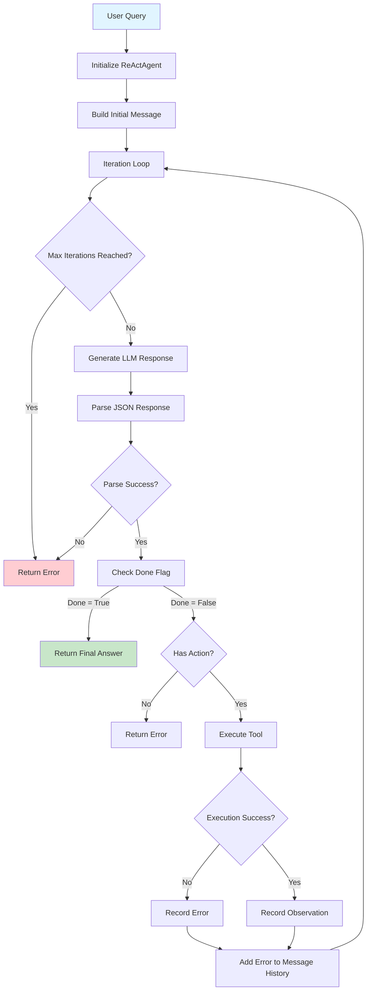
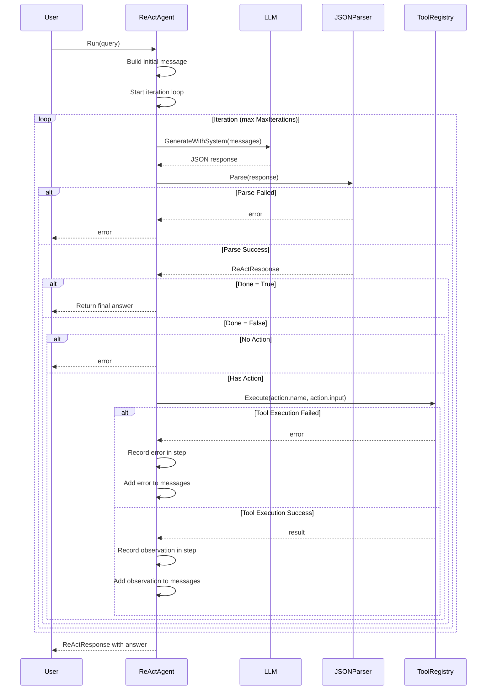
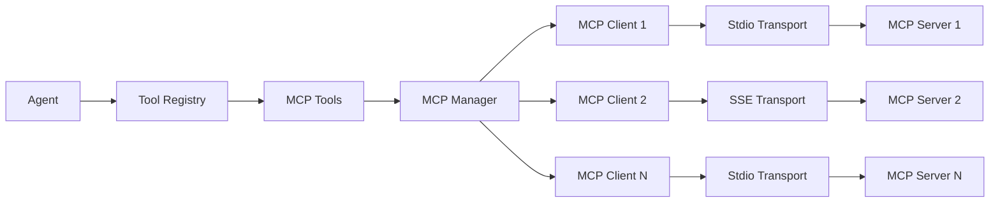
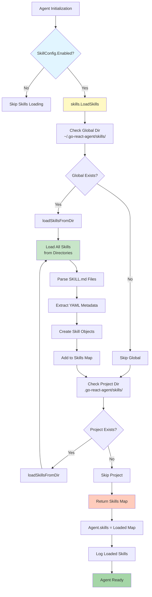
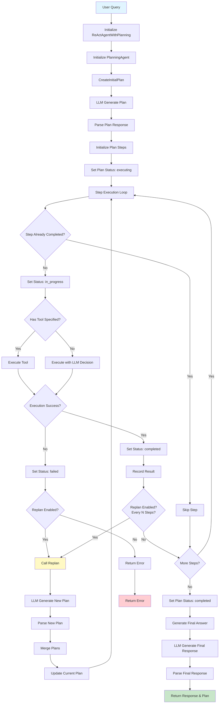
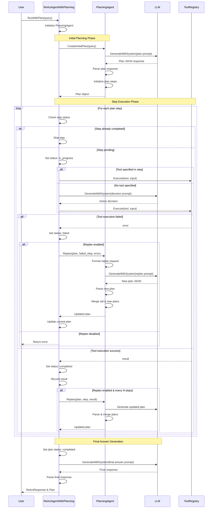

# Go ReAct Agent

<div align="center">


**A high-performance, production-ready ReAct Agent framework for building intelligent AI agents in Go**

[Features](#-features) • [Installation](#-installation) • [Quick Start](#-quick-start) • [Documentation](#-documentation) • [Examples](#-examples)

</div>

---

## 📖 About

Go ReAct Agent is a powerful framework for building intelligent agents that can reason, act, and observe using Large Language Models (LLMs). It implements the ReAct (Reasoning + Acting) pattern, enabling agents to break down complex tasks into manageable steps and use tools to accomplish goals.

### 🎯 What is ReAct?

ReAct is a paradigm that combines reasoning and acting in an iterative loop:

1. **Reasoning** (Thought) - The agent thinks about what action to take
2. **Acting** (Action) - The agent executes a tool or operation
3. **Observation** - The agent observes the result and updates its understanding
4. **Iteration** - The cycle repeats until the agent reaches a solution

### 🔄 React Agent Architecture

#### Component Overview



#### React Agent Flow Diagram



#### React Agent Sequence Diagram



### � JSON Response Format

The agent uses structured JSON responses for reliable parsing. LLMs respond with this format:

**For tool actions:**
```json
{
  "thoughts": [{"content": "I need to use a tool"}],
  "action": {"name": "tool_name", "input": {"param": "value"}},
  "answer": null,
  "done": false
}
```

**For final answers:**
```json
{
  "thoughts": [{"content": "I have enough information"}],
  "action": null,
  "answer": "Final answer here",
  "done": true
}
```

The parser automatically handles markdown code blocks (` ```json ... ` ` `) and validates responses for correctness.
## ✨ Features

- **🧠 Complete ReAct Architecture** - Full implementation of the Thought-Action-Observation loop
- **📋 JSON-Based Parsing** - Structured JSON responses with automatic validation and markdown handling
- **🔌 Multi-LLM Support** - Support for 10+ LLM providers including OpenAI, Anthropic, Google Gemini, Cohere, Mistral AI, AWS Bedrock, 阿里云通义千问, 百度文心一言, Ollama, and custom providers
- **🔧 Pluggable Parsers** - Custom response parsers via `ResponseParser` interface for specialized formats
- **🌐 Comprehensive Coverage** - Global LLM support including Chinese and international providers
- **🛠️ Tool System** - Extensible tool registration with built-in tools and easy custom tool creation
- **📝 Flexible Logging** - Console, file, and external logger support with configurable levels
- **⚡ Production-Ready** - Comprehensive error handling, timeouts, and context management
- **✅ Extensive Testing** - Full unit test coverage with mock implementations
- **📦 Easy Integration** - Clean package structure for seamless external imports
- **🎛️ Configurable** - Highly customizable agent behavior and system prompts
- **🔄 Streaming Support** - Real-time streaming of agent responses
- **📊 Callback System** - Monitor agent execution step-by-step with callbacks
- **🏪 Factory Pattern** - Unified LLM creation via factory interface
- **🌍 Local & Cloud** - Support for both local models (Ollama) and cloud APIs
- **🔌 MCP Integration** - Full Model Context Protocol support for connecting to external MCP servers
- **🎨 Claude Code Skills** - Official Claude Code Skills support using SKILL.md files for domain knowledge and guidance
- **🐛 Debug Mode** - Comprehensive debug logging for troubleshooting agent and MCP connections
- **🎯 Planning Feature** - Intelligent task decomposition and adaptive re-planning
- **📋 Structured Output** - User-defined struct output with automatic JSON schema generation

## 🔌 MCP Integration

The framework provides full Model Context Protocol (MCP) support, allowing you to connect your agent to external MCP servers and use their tools seamlessly.

### What is MCP?

Model Context Protocol (MCP) is an open protocol that enables AI models to securely interact with external systems. MCP servers expose tools that agents can call to perform actions like:
- Web scraping and data retrieval
- API integrations
- Database operations
- File system access
- And much more

### MCP Connection Process

The framework handles the complete MCP lifecycle:

1. **Configuration Loading** - Reads MCP server configurations from global and project files
2. **Manager Initialization** - Creates an MCP Manager to oversee all server connections
3. **Server Startup** - Starts each MCP server using its configured transport (stdio or SSE)
4. **Handshake** - Performs JSON-RPC 2.0 handshake with each server
5. **Tool Registration** - Retrieves available tools from each server and registers them with the agent
6. **Agent Integration** - MCP tools become part of the agent's tool registry and are callable like any other tool

### Configuration

Create or edit `~/.go-react-agent/mcp/mcp.json`:

```json
{
  "mcpServers": {
    "bright-data": {
      "command": "npx",
      "args": ["-y", "@brightdata/mcp-server"],
      "env": {
        "BRIGHTDATA_API_KEY": "your-api-key"
      }
    },
    "filesystem": {
      "command": "npx",
      "args": ["-y", "@modelcontextprotocol/server-filesystem", "/path/to/allowed/directory"]
    },
    "github": {
      "command": "npx",
      "args": ["-y", "@modelcontextprotocol/server-github"],
      "env": {
        "GITHUB_TOKEN": "your-github-token"
      }
    }
  }
}
```

### Supported Transports

#### Stdio Transport (Local Processes)
Runs MCP servers as local subprocesses with stdin/stdout communication:
```json
{
  "command": "npx",
  "args": ["-y", "@brightdata/mcp-server"],
  "env": {"API_KEY": "your-key"}
}
```

#### SSE Transport (Remote Servers)
Connects to remote MCP servers using Server-Sent Events:
```json
{
  "url": "https://mcp-server.example.com/sse",
  "headers": {
    "Authorization": "Bearer token"
  },
  "timeout": 30,
  "keepAlive": true
}
```

### Using MCP with Agent

Enable MCP integration in your agent configuration:

```go
package main

import (
    "github.com/dreamzero-oxm/go-react-agent/agent"
    "github.com/dreamzero-oxm/go-react-agent/llm"
)

func main() {
    // Create agent config with MCP enabled
    config := agent.DefaultConfig()
    config.MCPConfig.Enabled = true
    config.MCPConfig.AutoLoadConfig = true
    config.MCPConfig.GlobalConfigPath = "~/.go-react-agent/mcp/mcp.json"
    config.MCPConfig.ProjectConfigPath = ".go-react-agent/mcp/mcp.json"
    
    // Create LLM (e.g., OpenAI)
    openaiLLM, _ := llm.NewOpenAILLM(llm.OpenAIConfig{
        APIKey:  "your-api-key",
        Model:   "gpt-4",
        Timeout: 30,
    })
    
    // Create agent with MCP integration
    a := agent.NewReActAgent(openaiLLM, config)
    
    // MCP tools are now available to the agent
    response := a.Run(context.Background(), "Search the web for Go programming tutorials")
    
    fmt.Println(response.Answer)
}
```

#### Configuration Options

| Option | Type | Default | Description |
|--------|------|---------|-------------|
| `Enabled` | bool | false | Enable MCP integration |
| `AutoLoadConfig` | bool | true | Automatically load MCP config from files |
| `GlobalConfigPath` | string | `~/.go-react-agent/mcp/mcp.json` | Path to global MCP config file |
| `ProjectConfigPath` | string | `.go-react-agent/mcp/mcp.json` | Path to project MCP config file |

### MCP CLI Tool

Use the `mcp-cmd` command-line tool to manage MCP servers:

```bash
# Start all configured MCP servers
./mcp-cmd start

# Stop all running MCP servers
./mcp-cmd stop

# Check MCP server status with debug logging
./mcp-cmd status --debug

# List available MCP tools
./mcp-cmd list-tools

# Call an MCP tool directly
./mcp-cmd call bright-data_web_search --query "Go tutorials"
```

### Debug Mode for MCP

Enable debug mode to see detailed MCP connection information:

```go
config := agent.DefaultConfig()
config.MCPConfig.Enabled = true
config.MCPConfig.AutoLoadConfig = true
config.Debug = true  // Enable debug logging

// Set logger level to Debug when debug mode is enabled
if config.Debug {
    logger.SetLevel(logger.LevelDebug)
}
```

Or use the CLI flag:

```bash
./mcp-cmd status --debug
```

Debug mode logs:
- MCP server startup and shutdown
- JSON-RPC 2.0 handshake details
- Tool registration from each server
- Request/response payloads for MCP calls
- Connection errors and reconnection attempts

### Common Issues and Solutions

#### 1. MCP Server Not Found
**Problem**: `mcp-cmd status` shows "Server not found"

**Solution**: Verify the MCP server is installed and accessible:
```bash
npx -y @brightdata/mcp-server --help
```

#### 2. Environment Variables Missing
**Problem**: MCP server fails to start due to missing environment variables

**Solution**: The framework automatically merges parent environment with config environment. Ensure:
- Your environment variables are set in the shell
- Config file includes required environment variables in the `env` section

#### 3. Connection Timeout
**Problem**: MCP server connection times out

**Solution**: Increase timeout in SSE transport configuration:
```json
{
  "url": "https://mcp-server.example.com/sse",
  "timeout": 60
}
```

#### 4. Tool Not Found
**Problem**: Agent says "Tool not found" when calling MCP tool

**Solution**: Verify tool registration:
```bash
./mcp-cmd list-tools --debug
```

### MCP Architecture



### Example: Using Bright Data MCP Server

```go
package main

import (
    "context"
    "fmt"
    "github.com/dreamzero-oxm/go-react-agent/agent"
    "github.com/dreamzero-oxm/go-react-agent/llm"
    "github.com/dreamzero-oxm/go-react-agent/logger"
)

func main() {
    // Enable debug mode for MCP troubleshooting
    config := agent.DefaultConfig()
    config.MCPConfig.Enabled = true
    config.MCPConfig.AutoLoadConfig = true
    config.Debug = true
    
    if config.Debug {
        logger.SetLevel(logger.LevelDebug)
    }
    
    // Create LLM
    openaiLLM, _ := llm.NewOpenAILLM(llm.OpenAIConfig{
        APIKey:  os.Getenv("OPENAI_API_KEY"),
        Model:   "gpt-4",
        Timeout: 30,
    })
    
    // Create agent with MCP integration
    a := agent.NewReActAgent(openaiLLM, config)
    
    // Query using MCP web search tool
    response := a.Run(context.Background(), "Search for the latest Go programming tutorials")
    
    fmt.Printf("Answer: %s\n", response.Answer)
}
```

## 🎨 Claude Code Skills Support

go-react-agent supports the official Claude Code Skills format, allowing you to provide domain knowledge and guidance to the Agent through SKILL.md files.

### What are Claude Code Skills?

Claude Code Skills is a standard format for providing context and guidance to Claude through Markdown files. Each Skill contains:
- **YAML Metadata**: Name, version, description, tags
- **Markdown Content**: Detailed guidance, examples, best practices

Unlike executable tools, Skills provide **knowledge and guidance** that the Agent can reference to provide more accurate answers.

### Skill Loading Locations

Skills are automatically loaded from the following locations (project-level overrides global):

- **Global**: `~/.go-react-agent/skills/`
- **Project**: `.go-react-agent/skills/`

### Quick Start

#### 1. Create a Skill File

Create `~/.go-react-agent/skills/go-expert/SKILL.md`:

```yaml
---
name: go-expert
version: 1.0
description: |
  Provides expert knowledge about Go programming language including
  best practices, idioms, concurrency patterns, and common pitfalls.
tags:
  - go
  - golang
  - programming
---

# Go Expert Skill

This skill provides expert knowledge about Go programming.

## Concurrency Patterns

### Goroutines
```go
go func() {
    // Do work concurrently
}()
```

### Common Pitfalls

1. Not checking errors
2. Goroutine leaks
3. Channel misuse
```

#### 2. Enable Skills in Agent

```go
config := agent.DefaultConfig()
config.SkillConfig.Enabled = true

skillAgent, err := agent.NewAgentWithSkills(llm, config, log)
if err != nil {
    panic(err)
}

// Skills content is automatically injected into Agent's context
response, err := skillAgent.Run(ctx, "How do I properly handle errors in Go?")
```

### Features

- **Auto Selection** - Automatically selects relevant Skills based on query content
- **Context Injection** - Skills content is automatically injected into system prompts
- **Knowledge Sharing** - Multiple Skills can provide relevant guidance simultaneously
- **Flexible Configuration** - Configurable maximum number of skills to inject per query

### 🏗️ Skills Architecture

#### Skills Loading Flow Diagram



#### Skills Integration Sequence Diagram

```mermaid
sequenceDiagram
    participant User
    participant Agent as ReActAgent
    participant Loader as skills.LoadSkills
    participant LLM
    participant Prompt as Prompt Builder
    
    User->>Agent: NewAgentWithSkills(config)
    Agent->>Agent: Check SkillConfig.Enabled
    
    alt Skills Enabled
        Agent->>Loader: LoadSkills(globalDir, projectDir)
        
        Note over Loader: Load Global Skills
        Loader->>Loader: expandPath(globalDir)
        Loader->>Loader: loadSkillsFromDir(expandedDir)
        Loader->>Loader: Parse SKILL.md files
        Loader->>Loader: Extract metadata & content
        
        Note over Loader: Load Project Skills (Override Global)
        Loader->>Loader: loadSkillsFromDir(projectDir)
        Loader->>Loader: Parse SKILL.md files
        Loader->>Loader: Extract metadata & content
        
        Loader-->>Agent: map[string]*Skill
        
        Agent->>Agent: a.skills = loadedSkills
        Agent->>Agent: Log skill names & tags
    end
    
    User->>Agent: Run(ctx, query)
    
    Agent->>Prompt: Build System Prompt
    Prompt->>Prompt: injectSkillsContext(prompt)
    
    alt Skills Available
        Prompt->>Prompt: Iterate through skills map
        loop Each Skill
            Prompt->>Prompt: Append skill metadata<br/>Name, Version, Description, Tags
        end
        Prompt->>Prompt: Add "use_skill" action instruction
    end
    
    Prompt-->>Agent: Enhanced Prompt
    Agent->>LLM: Generate response with skill context
    LLM-->>Agent: Response
    
    alt Agent requests skill usage
        Agent->>Agent: handleSkillUsage(skillName, query)
        Agent->>Agent: a.skills[skillName]
        Agent->>LLM: Generate with full skill content
        LLM-->>Agent: Expert response
    end
    
    Agent-->>User: Final Response
    
    style Loader fill:#fff9c4
    style Prompt fill:#c8e6c9
```

For complete documentation, refer to [docs/claude-skills.md](docs/claude-skills.md)

## 🎯 Planning Feature

The planning feature enables intelligent task decomposition and adaptive execution for complex multi-step tasks.

### How Planning Works

1. **Initial Planning**: The agent analyzes the query and creates a structured plan before execution
2. **Step Execution**: Executes planned steps sequentially while tracking progress
3. **Adaptive Re-planning**: After each step (or every N steps), the agent updates the plan based on results

### 🏗️ Plan Agent Architecture

#### Plan Agent Flow Diagram



#### Plan Agent Sequence Diagram



### Enabling Planning

```go
// Create agent with planning enabled
planConfig := agent.DefaultPlanConfig()
planConfig.Enabled = true        // Enable planning
planConfig.ReplanEnabled = true  // Enable re-planning
planConfig.ReplanEvery = 1       // Re-plan after each step

config := agent.DefaultConfig()
config.PlanConfig = planConfig

planningAgent := agent.NewReActAgentWithPlanning(llm, config, planConfig, log)
planningAgent.InitializePlanning(llm)

// Register tools
tools.RegisterBuiltinToolsTo(planningAgent)

// Run with planning
response, plan, err := planningAgent.RunWithPlan(ctx, query)
if err != nil {
    panic(err)
}

fmt.Printf("Plan:\n")
for _, step := range plan.Steps {
    fmt.Printf("  [%s] %s\n", step.Status, step.Description)
}
fmt.Printf("Answer: %s\n", response.Answer)
```

### Planning Configuration Options

| Option | Type | Default | Description |
|--------|------|---------|-------------|
| `Enabled` | bool | false | Enable planning feature (opt-in) |
| `ReplanEnabled` | bool | true | Enable adaptive re-planning |
| `ReplanEvery` | int | 1 | Re-plan every N steps |
| `SystemPrompt` | string | "" | Custom planning system prompt |

### Backward Compatibility

The planning feature is completely opt-in. Existing code continues to work without changes:

```go
// Standard ReAct agent (no planning)
agent := agent.NewReActAgent(llm, config, log)
response, err := agent.Run(ctx, query) // Works as before

// Or with planning disabled
planConfig := agent.DefaultPlanConfig() // Enabled defaults to false
planningAgent := agent.NewReActAgentWithPlanning(llm, config, planConfig, log)
response, err := planningAgent.Run(ctx, query) // Falls back to standard execution
```

## 🎯 Structured Output Feature

The framework supports structured output with user-defined Go structs. Agents can return responses that strictly match your custom struct definitions.

### Why Structured Output?

- **Type Safety**: Compile-time type checking for agent outputs
- **IDE Support**: Auto-completion and refactoring support
- **Validation**: Automatic JSON schema generation and validation
- **Flexibility**: Supports nested structs, slices, maps, and custom tags

### Basic Usage

Define a struct with `json` and `agent` tags:

```go
type WeatherReport struct {
    City        string  `json:"city" agent:"desc:City name;required:true"`
    Temperature float64 `json:"temperature" agent:"desc:Temperature in Celsius;required:true;range:-50,60"`
    Humidity    int     `json:"humidity" agent:"desc:Humidity percentage;required:true;range:0,100"`
    Condition   string  `json:"condition" agent:"desc:Weather condition;enum:sunny,cloudy,rainy,snowy"`
}

// Use with React Agent
response, err := agent.RunStructured[WeatherReport](reactAgent, ctx, "What's the weather in Tokyo?")
fmt.Printf("City: %s\n", response.Output.City)
fmt.Printf("Temperature: %.1f°C\n", response.Output.Temperature)

// Use with Plan Agent
response, plan, err := agent.RunStructuredWithPlan[WeatherReport](planningAgent, ctx, query)
```

### Agent Tags

The `agent` tag supports these options:

| Option | Description | Example |
|--------|-------------|---------|
| `desc` | Field description | `desc:User name` |
| `required` | Whether field is required | `required:true` |
| `default` | Default value | `default:Anonymous` |
| `range` | Numeric range constraint | `range:0,150` |
| `enum` | Allowed values (comma-separated) | `enum:sunny,cloudy,rainy` |

#### Tag Format

```
agent:"desc:Description;required:true;default:value;range:min,max;enum:a,b,c"
```

### Supported Types

| Go Type | JSON Type | Notes |
|---------|-----------|-------|
| `string` | string | - |
| `int`, `int8-64`, `uint`, `uint8-64` | integer | - |
| `float32`, `float64` | number | - |
| `bool` | boolean | - |
| `struct` | object | Recursive processing |
| `slice`, `array` | array | With element type schema |
| `map` | object | Key-value pairs |
| `time.Time` | string | ISO 8601 format |

### Advanced Examples

#### Nested Structs

```go
type Address struct {
    Street  string `json:"street" agent:"desc:Street address"`
    City    string `json:"city" agent:"desc:City name;required:true"`
    Country string `json:"country" agent:"desc:Country name;required:true"`
}

type Person struct {
    Name    string  `json:"name" agent:"desc:Full name;required:true"`
    Age     int     `json:"age" agent:"desc:Age in years;range:0,150"`
    Address Address `json:"address" agent:"desc:Postal address"`
}
```

#### Arrays and Collections

```go
type TravelPlan struct {
    Destination string   `json:"destination" agent:"desc:Destination;required:true"`
    Duration    int      `json:"duration" agent:"desc:Trip duration in days;range:1,30"`
    Activities  []string `json:"activities" agent:"desc:List of activities"`
    Tips        []string `json:"tips" agent:"desc:Travel tips"`
}
```

### Configuration Options

```go
config := agent.DefaultConfig()
config.Output = &agent.OutputConfig{
    EnableStructuredOutput: true,  // Auto-enabled when using RunStructured
    MaxNestingDepth:        5,     // Max nested struct depth (default: 5)
    MaxParseRetries:        3,     // JSON parse retry attempts (default: 3)
}
```

### API Reference

#### React Agent Structured Output

| Function | Description |
|----------|-------------|
| `RunStructured[T](agent, ctx, query)` | Run agent with structured output |
| `RunStructuredWithCallback[T](agent, ctx, query, callback)` | Run with structured output and step callbacks |

#### Plan Agent Structured Output

| Function | Description |
|----------|-------------|
| `RunStructuredWithPlan[T](agent, ctx, query)` | Run with planning and structured output |

### Response Type

```go
type StructuredResponse[T any] struct {
    ReActResponse *ReActResponse  // Original response with thoughts
    Output        *T             // Parsed struct output
}
```

### Examples

See [example/example_structured.go](example/example_structured.go) and [examples_planning/example_plan_structured.go](examples_planning/example_plan_structured.go) for complete working examples.

## 📦 Installation

```bash
go get github.com/dreamzero-oxm/go-react-agent
```

## 🚀 Quick Start

### Basic Example

```go
package main

import (
    "context"
    "fmt"
    "os"

    "github.com/dreamzero-oxm/go-react-agent/agent"
    "github.com/dreamzero-oxm/go-react-agent/logger"
    "github.com/dreamzero-oxm/go-react-agent/llm"
    "github.com/dreamzero-oxm/go-react-agent/tools"
    "github.com/dreamzero-oxm/go-react-agent/agent"
    "github.com/dreamzero-oxm/go-react-agent/logger"
    "github.com/dreamzero-oxm/go-react-agent/llm"
    "github.com/dreamzero-oxm/go-react-agent/tools"
)

func main() {
    // Setup logging
    multiLog := logger.NewMultiLogger()
    multiLog.SetLevel(logger.LevelInfo)
    multiLog.AddConsoleLogger(true)

    // Configure LLM
    llmConfig := &llm.LLMConfig{
        APIKey:      os.Getenv("OPENAI_API_KEY"),
        BaseURL:     "https://api.openai.com/v1/chat/completions",
        Model:       "gpt-3.5-turbo",
        Temperature: 0.7,
        MaxTokens:   2000,
    }

    openaiLLM, err := llm.NewOpenAILLM(llmConfig)
    if err != nil {
        panic(err)
    }
    defer openaiLLM.Close()

    // Create agent with built-in tools
    reactAgent := agent.NewReActAgent(openaiLLM, agent.DefaultConfig(), multiLog)
    tools.RegisterBuiltinToolsTo(reactAgent)

    // Run the agent
    ctx := context.Background()
    response, err := reactAgent.Run(ctx, "Calculate 15 * 7 and tell me the result")
    if err != nil {
        panic(err)
    }

    fmt.Printf("Answer: %s\n", response.Answer)
}
```

### 🛠️ Custom Tools

Create custom tools to extend agent capabilities:

```go
customTool := &agent.Tool{
    Name:        "get_weather",
    Description: "Get current weather for a city",
    Parameters: map[string]agent.Parameter{
        "city": {
            Type:        "string",
            Description: "Name of the city",
            Required:    true,
        },
    },
    Execute: func(input map[string]interface{}) (string, error) {
        city, _ := input["city"].(string)
        return fmt.Sprintf("Weather in %s: Sunny, 25°C", city), nil
    },
}

if err := reactAgent.RegisterTool(customTool); err != nil {
    panic(err)
}
```

### 📊 Monitoring with Callbacks

Track agent execution in real-time:

```go
response, err := reactAgent.RunWithCallback(ctx, query, func(step *agent.Step) {
    if step.Action != nil {
        fmt.Printf("Action: %s\n", step.Action.Name)
        fmt.Printf("  Input: %v\n", step.Action.Input)
    }
    if step.Observation != nil {
        fmt.Printf("Observation: %s\n", step.Observation.Content)
    }
    if step.Error != "" {
        fmt.Printf("Error: %s\n", step.Error)
    }
})
```

## 📚 Documentation

### LLM Providers

The framework supports multiple LLM providers with unified configuration:

#### Supported Providers

| Provider | Description | Default Model |
|----------|-------------|----------------|
| `openai` | OpenAI GPT models | `gpt-3.5-turbo` |
| `anthropic` | Anthropic Claude models | `claude-3-sonnet-20240229` |
| `gemini` | Google Gemini models | `gemini-pro` |
| `cohere` | Cohere models | `command-r-plus` |
| `mistral` | Mistral AI models | `mistral-large-latest` |
| `bedrock` | AWS Bedrock | `anthropic.claude-3-sonnet-20240229-v1:0` |
| `dashscope` | 阿里云通义千问 | `qwen-turbo` |
| `wenxin` | 百度文心一言 | `ERNIE-Bot-4` |
| `ollama` | Ollama local models | `llama2` |
| `generic` | Generic REST API | `default-model` |
| `custom` | Custom implementations | N/A |

#### Configuration Examples

**OpenAI**
```go
config := &llm.LLMConfig{
    Provider: llm.ProviderOpenAI,
    APIKey:   os.Getenv("OPENAI_API_KEY"),
    Model:    "gpt-4",
    Temperature: 0.7,
    MaxTokens:  2000,
}
llm, _ := llm.NewLLM(config)
```

**Anthropic Claude**
```go
config := &llm.LLMConfig{
    Provider: llm.ProviderAnthropic,
    APIKey:   os.Getenv("ANTHROPIC_API_KEY"),
    Model:    "claude-3-opus-20240229",
    Temperature: 0.7,
    MaxTokens:  4000,
}
llm, _ := llm.NewLLM(config)
```

**Google Gemini**
```go
config := &llm.LLMConfig{
    Provider: llm.ProviderGemini,
    APIKey:   os.Getenv("GEMINI_API_KEY"),
    Model:    "gemini-pro",
    Temperature: 0.7,
    MaxTokens:  2000,
}
llm, _ := llm.NewLLM(config)
```

**阿里云通义千问**
```go
config := &llm.LLMConfig{
    Provider: llm.ProviderDashScope,
    APIKey:   os.Getenv("DASHSCOPE_API_KEY"),
    Model:    "qwen-plus",
    Temperature: 0.7,
    MaxTokens:  2000,
}
llm, _ := llm.NewLLM(config)
```

**百度文心一言**
```go
config := &llm.LLMConfig{
    Provider: llm.ProviderWenxin,
    APIKey:   os.Getenv("WENXIN_API_KEY") + "|" + os.Getenv("WENXIN_SECRET_KEY"),
    Model:    "ERNIE-Bot-4",
    Temperature: 0.7,
    MaxTokens:  2000,
}
llm, _ := llm.NewLLM(config)
```

**Ollama (Local Models)**
```go
config := &llm.LLMConfig{
    Provider: llm.ProviderOllama,
    BaseURL:  "http://localhost:11434/api/chat",
    Model:    "llama2",
    Temperature: 0.7,
    MaxTokens:  2000,
}
llm, _ := llm.NewLLM(config)
```

**AWS Bedrock**
```go
config := &llm.LLMConfig{
    Provider:    llm.ProviderBedrock,
    AccessKeyID:  os.Getenv("AWS_ACCESS_KEY_ID"),
    SecretAccessKey: os.Getenv("AWS_SECRET_ACCESS_KEY"),
    Region:      "us-east-1",
    Model:       "anthropic.claude-3-sonnet-20240229-v1:0",
    Temperature: 0.7,
    MaxTokens:   2000,
}
llm, _ := llm.NewLLM(config)
```

**Generic REST API**
```go
config := &llm.LLMConfig{
    Provider: llm.ProviderGeneric,
    BaseURL:  "https://your-api.com/v1/chat/completions",
    APIKey:   os.Getenv("YOUR_API_KEY"),
    Model:    "your-model-name",
    Temperature: 0.7,
    MaxTokens:  2000,
}
llm, _ := llm.NewLLM(config)
```

#### Factory Pattern

Use the unified factory to create LLM instances:

```go
// Using full config
config := &llm.LLMConfig{
    Provider: llm.ProviderOpenAI,
    APIKey:   "your-api-key",
    Model:    "gpt-4",
}
llm, err := llm.NewLLM(config)

// Using helper function
llm, err := llm.NewLLMWithProvider(llm.ProviderGemini, "your-api-key", "gemini-pro")
```

### Configuration

#### Agent Configuration

```go
config := &agent.Config{
    MaxIterations: 10,
    Timeout:       5 * time.Minute,
    Parser:        agent.NewJSONParser(),  // Use default JSON parser
    Parser:        agent.NewJSONParser(),  // Use default JSON parser
}
reactAgent := agent.NewReActAgent(llm, config, log)
```

Or use defaults (includes JSON parser):
Or use defaults (includes JSON parser):

```go
config := agent.DefaultConfig()
```

#### Logging Levels

- `LevelDebug` - Detailed debugging information
- `LevelInfo` - General informational messages (default)
- `LevelWarn` - Warning messages
- `LevelError` - Error messages only
- `LevelFatal` - Fatal errors that cause program exit

#### Custom Response Parsers

Implement the `ResponseParser` interface for custom response formats:

```go
// Define a custom parser
type XMLParser struct{}

func (x *XMLParser) Parse(response string) (*agent.ReActResponse, error) {
    // Your custom parsing logic
    // For example: parse XML format instead of JSON
    // ...
    return &agent.ReActResponse{}, nil
}

// Use the custom parser
config := agent.DefaultConfig()
config.Parser = &XMLParser{}
reactAgent := agent.NewReActAgent(llm, config, log)
```

This is useful when:
- Using LLMs that don't support JSON output well
- Working with specialized response formats
- Implementing custom validation or preprocessing
### Built-in Tools

The framework includes these ready-to-use tools:

#### Math & Calculation
| Tool | Description |
|------|-------------|
| `calculate` | Evaluates basic arithmetic expressions with support for addition, subtraction, multiplication, division, and parentheses |

#### HTTP & Network
| Tool | Description |
|------|-------------|
| `http_get` | Performs HTTP GET requests to specified URLs and returns response with status code and body |

#### File Operations
| Tool | Description |
|------|-------------|
| `read_file` | Reads complete file contents from specified path and returns text |
| `write_file` | Writes content to files with support for overwrite or append modes |
| `delete_file` | Permanently deletes files at specified paths |
| `list_files` | Lists all files and subdirectories in a specified directory with optional hidden file inclusion |
| `create_directory` | Creates new directories with automatic parent directory creation (like mkdir -p) |
| `search_files` | Searches for files matching patterns in directories with wildcard and recursive support |

#### Text & Data Processing
| Tool | Description |
|------|-------------|
| `echo` | Returns provided text content with optional case transformation |
| `format_text` | Applies various text transformations including case conversion, reversal, trimming, and replacement |
| `base64_encode` | Encodes text or data into Base64 format using standard encoding scheme |
| `base64_decode` | Decodes Base64 encoded data back to original text |
| `regex_match` | Tests if text matches specified regular expression patterns |
| `json_parse` | Parses and validates JSON strings with support for field extraction |
| `url_encode` | Performs URL encoding on text for safe use in URLs and query parameters |
| `url_decode` | Decodes URL-encoded strings back to plain text |

#### Time & Date
| Tool | Description |
|------|-------------|
| `current_time` | Retrieves current date and time with multiple output formats and timezone support |

#### Registering Tools

Register all built-in tools:

```go
tools.RegisterBuiltinToolsTo(reactAgent)
```

Register individual tools:

```go
reactAgent.RegisterTool(tools.NewCalculateTool())
reactAgent.RegisterTool(tools.NewReadFileTool())
reactAgent.RegisterTool(tools.NewWriteFileTool())
reactAgent.RegisterTool(tools.NewSearchFilesTool())
// ... or any other built-in tool
```

### API Reference

#### Agent Methods

| Method | Description |
|--------|-------------|
| `NewReActAgent(llm, config, log)` | Create a new ReAct agent |
| `Run(ctx, query)` | Run agent with a query |
| `RunWithCallback(ctx, query, callback)` | Run with step callbacks |
| `RegisterTool(tool)` | Register a custom tool |
| `UnregisterTool(name)` | Unregister a tool |
| `SetSystemPrompt(prompt)` | Set custom system prompt |
| `Close()` | Close agent and release resources |

#### Tool Structure

```go
type Tool struct {
    Name        string                      // Tool identifier
    Description string                      // Tool description
    Parameters  map[string]Parameter        // Parameter definitions
    Execute     func(input map[string]interface{}) (string, error) // Execution logic
}

type Parameter struct {
    Type        string  // Parameter type
    Description string  // Parameter description
    Required    bool    // Whether required
}
```

## 🧪 Testing

Run all tests:

```bash
go test ./...
```

Run tests with coverage:

```bash
go test -cover ./...
```

Run tests with verbose output:

```bash
go test -v ./...
```

Run tests for a specific package:

```bash
go test ./agent -v
go test ./llm -v
go test ./logger -v
go test ./tools -v
```

## 💡 Examples

### Example 1: Basic Agent

See [example/example.go](example/example.go) for a complete working example.

```bash
cd example
export OPENAI_API_KEY="your-api-key"
go run example.go
```

### Example 2: Structured Output

See [example/example_structured.go](example/example_structured.go) for a complete structured output example.

```bash
cd example
export OPENAI_API_KEY="your-api-key"
go run example_structured.go
```

### Example 3: Structured Planning

See [examples_planning/example_plan_structured.go](examples_planning/example_plan_structured.go) for structured output with planning.

```bash
cd examples_planning
export OPENAI_API_KEY="your-api-key"
go run example_plan_structured.go
```

### Example 4: Custom Tools

```go
// Define a custom tool
weatherTool := &agent.Tool{
    Name:        "get_weather",
    Description: "Get current weather for a location",
    Parameters: map[string]agent.Parameter{
        "location": {
            Type:        "string",
            Description: "City name or coordinates",
            Required:    true,
        },
    },
    Execute: func(input map[string]interface{}) (string, error) {
        location := input["location"].(string)
        return fmt.Sprintf("Weather in %s: 72°F, Sunny", location), nil
    },
}

agent.RegisterTool(weatherTool)
```

### Example 3: Advanced Logging

```go
// Setup multiple log outputs
multiLog := logger.NewMultiLogger()
multiLog.SetLevel(logger.LevelDebug)

// Console logging with colors
multiLog.AddConsoleLogger(true)

// File logging
fileLog, err := multiLog.AddFileLogger("agent.log")
if err != nil {
    panic(err)
}
defer fileLog.Close()

// External logger integration
type CustomLogger struct{}

func (l *CustomLogger) Log(level logger.Level, msg string, fields map[string]interface{}) {
    fmt.Printf("[%s] %s %v\n", level, msg, fields)
}

multiLog.SetExternalLogger(&CustomLogger{})

// Toggle logging on/off
multiLog.Disable()
multiLog.Enable()
```

## 🎯 Best Practices

### Tool Development

- **Single Responsibility**: Keep tools focused on one specific task
- **Clear Descriptions**: Provide detailed descriptions for better agent understanding
- **Parameter Validation**: Always validate input parameters before execution
- **Error Handling**: Return descriptive errors that help agents understand failures
- **Idempotency**: Make tools idempotent when possible

### Agent Usage

- **Resource Management**: Always close LLM and logger instances when done
- **Timeouts**: Set appropriate timeouts for your use case
- **Context**: Always use context for cancellation support
- **Logging**: Use appropriate log levels (Debug for development, Info for production)
- **System Prompts**: Customize system prompts for specific use cases
- **Testing**: Use mock LLMs for unit testing

### Performance

- **Tool Efficiency**: Keep tool execution fast to minimize latency
- **Batch Operations**: Group related operations when possible
- **Caching**: Implement caching for expensive operations
- **Concurrency**: Use goroutines for parallel independent operations

## 🤝 Contributing

We welcome contributions! Here's how you can help:

1. **Fork the repository**
2. **Create a feature branch** (`git checkout -b feature/amazing-feature`)
3. **Commit your changes** (`git commit -m 'Add amazing feature'`)
4. **Push to the branch** (`git push origin feature/amazing-feature`)
5. **Open a Pull Request**

### Development Guidelines

- Follow Go conventions and best practices
- Write tests for new functionality
- Update documentation as needed
- Ensure all tests pass before submitting
- Use meaningful commit messages

## 📄 License

This project is licensed under the MIT License - see the [LICENSE](LICENSE) file for details.

## 🙏 Acknowledgments

- ReAct paper: "ReAct: Synergizing Reasoning and Acting in Language Models"
- OpenAI for GPT models and API
- The Go community for excellent tooling and libraries

## 📞 Support

- **Issues**: Open an issue on GitHub for bugs or feature requests
- **Discussions**: Use GitHub Discussions for questions and ideas
- **Documentation**: Check inline code documentation for detailed API info

## 📝 CHANGELOG

### [Unreleased] - 2025-02-24

#### Added
- **MCP Integration**: Full Model Context Protocol support for connecting to external MCP servers
  - MCP Manager for server lifecycle management
  - MCP Client for JSON-RPC 2.0 communication
  - Transport layer abstraction (Stdio for local processes, SSE for remote servers)
  - MCP tool adapter to integrate MCP tools with agent tool registry
  - Automatic config loading from `~/.go-react-agent/mcp.json`
  - MCP CLI tool (`mcp-cmd`) for server management: start, stop, status, list-tools, call
  - Environment variable merging for subprocess MCP servers
- **Debug Mode**: Comprehensive debug logging for troubleshooting agent and MCP connections
  - Debug flag in agent configuration (`Config.Debug`)
  - Debug logging at Manager, Client, and Transport layers
  - Debug logging for agent execution (system prompt, message history, tool calls)
  - `--debug` flag support in mcp-cmd CLI tool
  - Automatic logger level setting when debug mode is enabled
  - JSON-RPC 2.0 request/response logging
  - SSE event parsing and reconnection logging

#### Fixed
- Environment variable handling in stdio transport: Fixed to merge parent environment with config environment instead of replacing
- JSON-RPC response ID type mismatch: Fixed float64 vs int64 comparison issue causing request timeouts
- Message history bug: Added agent thoughts and actions to conversation history to prevent tool repetition
- Tool execution context: Fixed missing agent response in message history causing LLM to lose track of execution

#### Documentation
- Added MCP Integration section to README with comprehensive usage guide
- Added debug mode documentation with examples and troubleshooting tips
- Added MCP architecture diagram and connection process explanation
- Added MCP CLI tool documentation
- Added common issues and solutions for MCP integration

### [Unreleased] - 2025-02-19

#### Added
- **Structured Output Feature**: User-defined struct output with automatic JSON schema generation
  - `StructuredResponse[T]` generic type for type-safe structured outputs
  - `RunStructured[T]()` function for React Agent structured output
  - `RunStructuredWithCallback[T]()` for structured output with step monitoring
  - `RunStructuredWithPlan[T]()` for Plan Agent structured output
  - `OutputConfig` for configuring structured output behavior
  - `StructParser` for parsing Go structs and generating JSON schemas
  - `agent` tag support: `desc`, `required`, `default`, `range`, `enum`
  - Support for nested structs, slices, maps, and all basic Go types

#### Documentation
- Added Structured Output Feature section to README with usage examples
- Added structured output examples: `example/example_structured.go` and `examples_planning/example_plan_structured.go`

#### Added
- **Planning Feature**: Initial plan generation and adaptive re-planning capability
  - `ReActAgentWithPlanning` for plan-enabled agents
  - `Plan` and `PlanStep` types for structured plan representation
  - `PlanningAgent` for plan creation and updates
  - `PlanConfig` for planning behavior configuration
  - `RunWithPlan()` method returning both response and plan
  - `GetPlan()` method to retrieve current execution plan

#### Documentation
- Added Planning Feature section to README with usage examples
- Added CHANGELOG section to track feature additions

### [1.0.0] - Initial Release
- Core ReAct agent architecture
- Multi-LLM support (OpenAI, Anthropic, Gemini, etc.)
- JSON-based response parsing with markdown handling
- Built-in tools (calculate, http_get, read_file, write_file, echo, search_files)
- Callback system for monitoring
- Streaming support

## 🔗 Links

- **Issues**: Open an issue on GitHub for bugs or feature requests
- **Discussions**: Use GitHub Discussions for questions and ideas
- **Documentation**: Check inline code documentation for detailed API info

## 🔗 Links

- **Issues**: Open an issue on GitHub for bugs or feature requests
- **Discussions**: Use GitHub Discussions for questions and ideas
- **Documentation**: Check inline code documentation for detailed API info

## 🔗 Links

- [GitHub Repository](https://github.com/dreamzero-oxm/go-react-agent)
- [API Documentation](https://pkg.go.dev/github.com/dreamzero-oxm/go-react-agent)
- [GitHub Repository](https://github.com/dreamzero-oxm/go-react-agent)
- [API Documentation](https://pkg.go.dev/github.com/dreamzero-oxm/go-react-agent)
- [GitHub Repository](https://github.com/dreamzero-oxm/go-react-agent)
- [API Documentation](https://pkg.go.dev/github.com/dreamzero-oxm/go-react-agent)
- [Examples](./example/)

---

<div align="center">

**Made with ❤️ by the Go ReAct Agent community**

[⬆ Back to Top](#go-react-agent)

</div>
