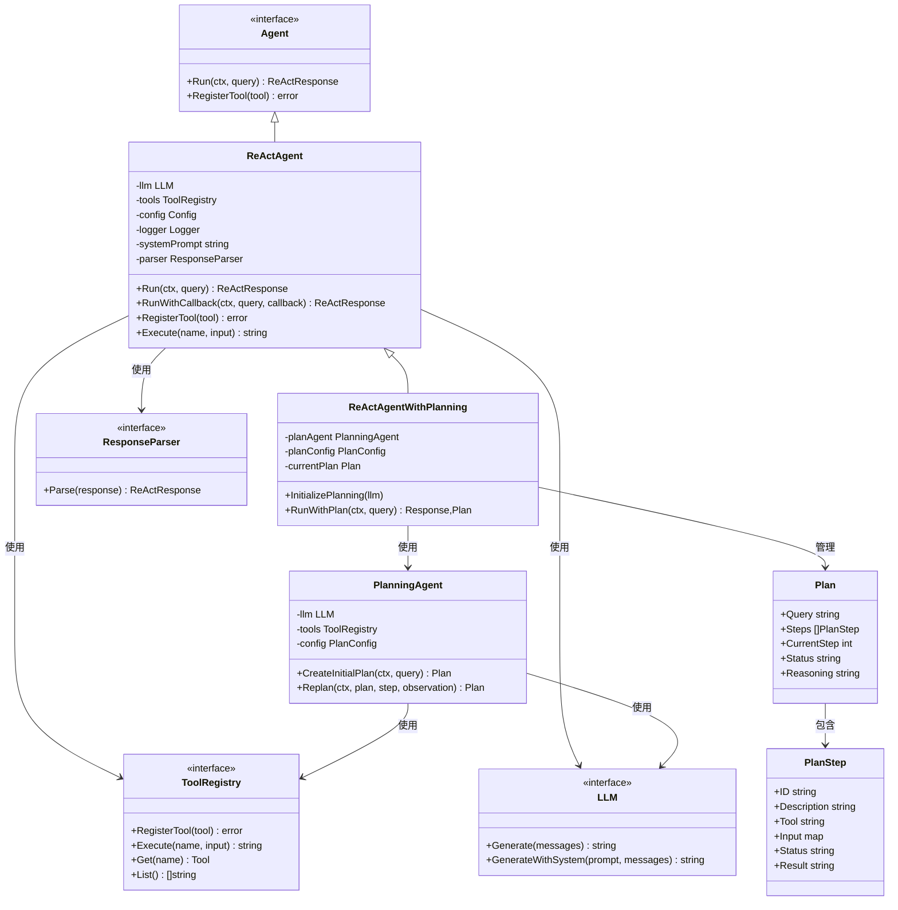
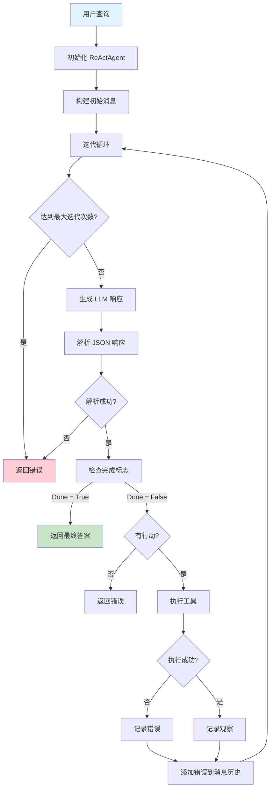
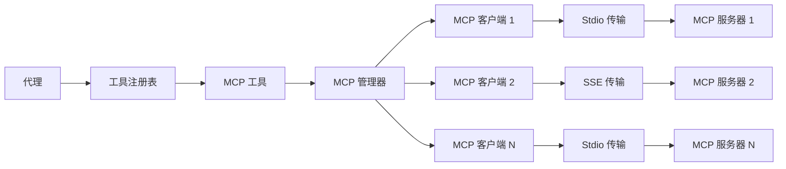
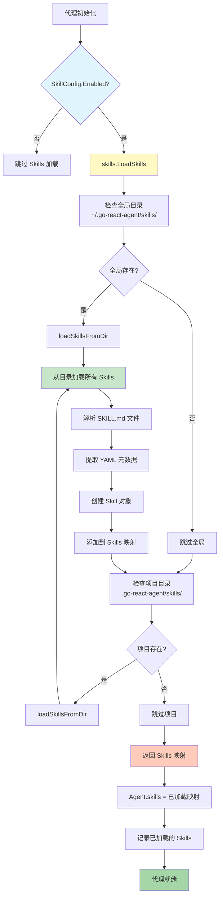
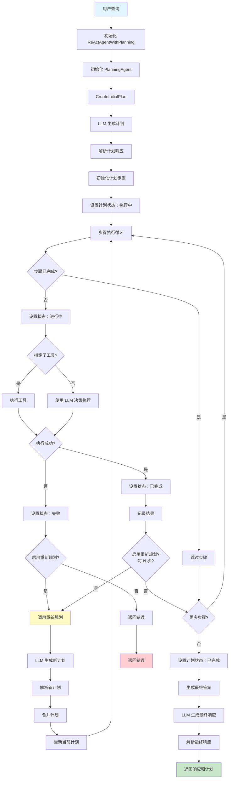

# Go ReAct Agent

<div align="center">


**一个高性能、生产就绪的 ReAct Agent 框架，用于在 Go 中构建智能 AI 代理**

[特性](#-特性) • [安装](#-安装) • [快速开始](#-快速开始) • [文档](#-文档) • [示例](#-示例)

</div>

---

## 📖 关于

Go ReAct Agent 是一个用于构建智能代理的强大框架，这些代理可以使用大语言模型（LLM）进行推理、行动和观察。它实现了 ReAct（推理 + 行动）模式，使代理能够将复杂任务分解为可管理的步骤，并使用工具来完成目标。

### 🎯 什么是 ReAct?

ReAct 是一种将推理和行动结合在迭代循环中的范式：

1. **推理**（思考）- 代理思考要采取的行动
2. **行动**（执行）- 代理执行工具或操作
3. **观察**（观察）- 代理观察结果并更新理解
4. **迭代**- 循环重复，直到代理达到解决方案

### 🔄 React Agent 架构

#### 组件概览



#### React Agent 流程图



#### React Agent 时序图

```mermaid
sequenceDiagram
    participant User
    participant Agent as ReActAgent
    participant LLM
    participant Parser as JSONParser
    participant Tool as ToolRegistry
    
    User->>Agent: Run(query)
    Agent->>Agent: 构建初始消息
    Agent->>Agent: 开始迭代循环
    
    loop 迭代 (最大 MaxIterations)
        Agent->>LLM: GenerateWithSystem(messages)
        LLM-->>Agent: JSON 响应
        Agent->>Parser: Parse(response)
        
        alt 解析失败
            Parser-->>Agent: 错误
            Agent-->>User: 错误
        else 解析成功
            Parser-->>Agent: ReActResponse
            
            alt Done = True
                Agent-->>User: 返回最终答案
            else Done = False
                alt 无行动
                    Agent-->>User: 错误
                else 有行动
                    Agent->>Tool: Execute(action.name, action.input)
                    
                    alt 工具执行失败
                        Tool-->>Agent: 错误
                        Agent->>Agent: 在步骤中记录错误
                        Agent->>Agent: 添加错误到消息
                    else 工具执行成功
                        Tool-->>Agent: 结果
                        Agent->>Agent: 在步骤中记录观察
                        Agent->>Agent: 添加观察到消息
                    end
                end
        end
    end
    
    Agent-->>User: ReActResponse with answer
```

### 📋 JSON 响应格式

代理使用结构化的 JSON 响应进行可靠解析。LLM 以此格式响应：

**对于工具行动：**
```json
{
  "thoughts": [{"content": "我需要使用工具"}],
  "action": {"name": "tool_name", "input": {"param": "value"}},
  "answer": null,
  "done": false
}
```

**对于最终答案：**
```json
{
  "thoughts": [{"content": "我有足够的信息"}],
  "action": null,
  "answer": "最终答案在这里",
  "done": true
}
```

解析器自动处理 markdown 代码块（```json ... ```）并验证响应的正确性。

## ✨ 特性

- **🧠 完整的 ReAct 架构** - 完整实现思考-行动-观察循环
- **📋 基于 JSON 的解析** - 结构化的 JSON 响应，带有自动验证和 markdown 处理
- **🔌 多 LLM 支持** - 支持 10+ 个 LLM 提供商，包括 OpenAI、Anthropic、Google Gemini、Cohere、Mistral AI、AWS Bedrock、阿里云通义千问、百度文心一言、Ollama 和自定义提供者
- **🔧 可插拔解析器** - 通过 `ResponseParser` 接口支持自定义响应格式
- **🌐 全面覆盖** - 全局 LLM 支持，包括中国和国际提供商
- **🛠️ 工具系统** - 可扩展的工具注册，带有内置工具和简单的自定义工具创建
- **📝 灵活的日志记录** - 控制台、文件和外部日志记录器支持，带有可配置级别
- **⚡ 生产就绪** - 全面的错误处理、超时和上下文管理
- **✅ 广泛测试** - 完整的单元测试覆盖，带有模拟实现
- **📦 易于集成** - 清晰的包结构，用于无缝外部导入
- **🎛️ 可配置** - 高度可配置的代理行为和系统提示
- **🔄 流式支持** - 代理响应的实时流式传输
- **📊 回调系统** - 使用回调逐步监控代理执行
- **🏪 工厂模式** - 通过工厂接口统一 LLM 创建
- **🌍 本地和云** - 支持本地模型和云 API
- **🔌 MCP 集成** - 完整的模型上下文协议支持，用于连接外部 MCP 服务器
- **🎨 Claude Code Skills** - 官方 Claude Code Skills 支持，使用 SKILL.md 文件提供领域知识和指导
- **🐛 调试模式** - 用于故障排除代理和 MCP 连接的综合调试日志记录
- **🎯 规划功能** - 智能任务分解和自适应重新规划
- **📋 结构化输出** - 用户定义的结构体输出，带有自动 JSON 模式生成

## 🔌 MCP 集成

该框架提供完整的模型上下文协议（MCP）支持，允许您将代理连接到外部 MCP 服务器并无缝地使用它们的工具。

### 什么是 MCP？

模型上下文协议（MCP）是一种开放协议，使 AI 模型能够安全地与外部系统交互。MCP 服务器暴露工具，代理可以调用这些工具来执行操作，例如：
- 网络爬取和数据检索
- API 集成
- 数据库操作
- 文件系统访问
- 以及更多

### MCP 连接过程

该框架处理完整的 MCP 生命周期：

1. **配置加载** - 从 `~/.config/mcp/config.json` 读取 MCP 服务器配置
2. **管理器初始化** - 创建 MCP 管理器以监督所有服务器连接
3. **服务器启动** - 使用其配置的传输（stdio 或 SSE）启动每个 MCP 服务器
4. **握手** - 与每个服务器执行 JSON-RPC 2.0 握手
5. **工具注册** - 从每个服务器检索可用工具并将它们注册到代理
6. **代理集成** - MCP 工具成为代理工具注册表的一部分，可以像任何其他工具一样调用

### 配置

创建或编辑 `~/.go-react-agent/mcp/mcp.json`：

```json
{
  "mcpServers": {
    "bright-data": {
      "command": "npx",
      "args": ["-y", "@brightdata/mcp-server"],
      "env": {
        "BRIGHTDATA_API_KEY": "your-api-key"
      }
    },
    "filesystem": {
      "command": "npx",
      "args": ["-y", "@modelcontextprotocol/server-filesystem", "/path/to/allowed/directory"]
    },
    "github": {
      "command": "npx",
      "args": ["-y", "@modelcontextprotocol/server-github"],
      "env": {
        "GITHUB_TOKEN": "your-github-token"
      }
    }
  }
}
```

### 支持的传输

#### Stdio 传输（本地进程）

使用 stdin/stdout 通信将 MCP 服务器作为本地子进程运行：
```json
{
  "command": "npx",
  "args": ["-y", "@brightdata/mcp-server"],
  "env": {"API_KEY": "your-key"}
}
```

#### SSE 传输（远程服务器）

使用服务器发送事件连接到远程 MCP 服务器：
```json
{
  "url": "https://mcp-server.example.com/sse",
  "headers": {
    "Authorization": "Bearer token"
  },
  "timeout": 30,
  "keepAlive": true
}
```

### 在代理中使用 MCP

在代理配置中启用 MCP 集成：

```go
package main

import (
    "github.com/dreamzero-oxm/go-react-agent/agent"
    "github.com/dreamzero-oxm/go-react-agent/llm"
)

func main() {
    // 创建启用了 MCP 的代理配置
    config := agent.DefaultConfig()
    config.MCPConfig.Enabled = true
    config.MCPConfig.AutoLoadConfig = true
    config.MCPConfig.GlobalConfigPath = "~/.go-react-agent/mcp/mcp.json"
    config.MCPConfig.ProjectConfigPath = ".go-react-agent/mcp/mcp.json"
    
    // 创建 LLM（例如，OpenAI）
    openaiLLM, _ := llm.NewOpenAILLM(llm.OpenAIConfig{
        APIKey:  "your-api-key",
        Model:   "gpt-4",
        Timeout: 30,
    })
    
    // 创建集成了 MCP 的代理
    a := agent.NewReActAgent(openaiLLM, config)
    
    // MCP 工具现在可供代理使用
    response := a.Run(context.Background(), "搜索 Go 编程教程")
    
    fmt.Println(response.Answer)
}
```

#### 配置选项

| 选项 | 类型 | 默认值 | 描述 |
|--------|------|---------|-------------|
| `Enabled` | bool | false | 启用 MCP 集成 |
| `AutoLoadConfig` | bool | true | 从文件自动加载 MCP 配置 |
| `GlobalConfigPath` | string | `~/.go-react-agent/mcp/mcp.json` | 全局 MCP 配置文件路径 |
| `ProjectConfigPath` | string | `.go-react-agent/mcp/mcp.json` | 项目 MCP 配置文件路径 |

### MCP CLI 工具

使用 `mcp-cmd` 命令行工具管理 MCP 服务器：

```bash
# 启动所有配置的 MCP 服务器
./mcp-cmd start

# 停止所有运行的 MCP 服务器
./mcp-cmd stop

# 检查 MCP 服务器状态，带有调试日志
./mcp-cmd status --debug

# 列出可用的 MCP 工具
./mcp-cmd list-tools

# 直接调用 MCP 工具
./mcp-cmd call bright-data_web_search --query "Go 教程"
```

### MCP 的调试模式

启用调试模式以查看详细的 MCP 连接信息：

```go
config := agent.DefaultConfig()
config.MCPConfig.Enabled = true
config.MCPConfig.AutoLoadConfig = true
config.Debug = true  // 启用调试日志记录

// 在启用调试模式时将日志级别设置为 Debug
if config.Debug {
    logger.SetLevel(logger.LevelDebug)
}
```

或使用 CLI 标志：

```bash
./mcp-cmd status --debug
```

调试模式日志：
- MCP 服务器启动和关闭
- JSON-RPC 2.0 握手详细信息
- 来自每个服务器的工具注册
- MCP 调用的请求/响应负载
- 连接错误和重新连接尝试

### 常见问题和解决方案

#### 1. MCP 服务器未找到
**问题**：`mcp-cmd status` 显示"服务器未找到"

**解决方案**：验证 MCP 服务器已安装且可访问：
```bash
npx -y @brightdata/mcp-server --help
```

#### 2. 环境变量缺失
**问题**：由于缺少环境变量，MCP 服务器启动失败

**解决方案**：框架自动将父环境与配置环境合并。确保：
- 在 shell 中设置了环境变量
- 配置文件在 `env` 部分中包含所需的环境变量

#### 3. 连接超时
**问题**：MCP 服务器连接超时

**解决方案**：在 SSE 传输配置中增加超时：
```json
{
  "url": "https://mcp-server.example.com/sse",
  "timeout": 60
}
```

#### 4. 工具未找到
**问题**：调用 MCP 工具时，代理说"工具未找到"

**解决方案**：验证工具注册：
```bash
./mcp-cmd list-tools --debug
```

### MCP 架构



### 示例：使用 Bright Data MCP 服务器

```go
package main

import (
    "context"
    "fmt"
    "github.com/dreamzero-oxm/go-react-agent/agent"
    "github.com/dreamzero-oxm/go-react-agent/llm"
    "github.com/dreamzero-oxm/go-react-agent/logger"
)

func main() {
    // 为 MCP 故障排除启用调试模式
    config := agent.DefaultConfig()
    config.MCPConfig.Enabled = true
    config.MCPConfig.AutoLoadConfig = true
    config.Debug = true
    
    if config.Debug {
        logger.SetLevel(logger.LevelDebug)
    }
    
    // 创建 LLM
    openaiLLM, _ := llm.NewOpenAILLM(llm.OpenAIConfig{
        APIKey:  os.Getenv("OPENAI_API_KEY"),
        Model:   "gpt-4",
        Timeout: 30,
    })
    
    // 创建集成了 MCP 的代理
    a := agent.NewReActAgent(openaiLLM, config)
    
    // 使用 MCP 网络搜索工具查询
    response := a.Run(context.Background(), "搜索最新的 Go 编程教程")
    
    fmt.Printf("答案: %s\n", response.Answer)
}
```

## 🎨 Claude Code Skills 支持

go-react-agent 支持官方的 Claude Code Skills 格式，允许您通过 SKILL.md 文件为代理提供领域知识和指导。

### 什么是 Claude Code Skills？

Claude Code Skills 是一种通过 Markdown 文件为 Claude 提供上下文和指导的标准格式。每个 Skill 包含：
- **YAML 元数据**：名称、版本、描述、标签
- **Markdown 内容**：详细的指导、示例、最佳实践

与可执行工具不同，Skills 提供**知识和指导**，代理可以引用这些知识来提供更准确的答案。

### Skill 加载位置

Skills 从以下位置自动加载（项目级覆盖全局）：

- **全局**：`~/.go-react-agent/skills/`
- **项目**：`.go-react-agent/skills/`

### 快速开始

#### 1. 创建 Skill 文件

创建 `~/.go-react-agent/skills/go-expert/SKILL.md`：

```yaml
---
name: go-expert
version: 1.0
description: |
  提供 Go 编程语言的专家知识，包括
  最佳实践、惯用语、并发模式和常见陷阱。
tags:
  - go
  - golang
  - programming
---

# Go Expert Skill

此技能提供关于 Go 编程的专家知识。

## 并发模式

### Goroutines
```go
go func() {
    // 并发执行工作
}()
```

### 常见陷阱

1. 不检查错误
2. Goroutine 泄漏
3. 通道误用
```

#### 2. 在代理中启用 Skills

```go
config := agent.DefaultConfig()
config.SkillConfig.Enabled = true

skillAgent, err := agent.NewAgentWithSkills(llm, config, log)
if err != nil {
    panic(err)
}

// Skills 内容自动注入到代理的上下文中
response, err := skillAgent.Run(ctx, "我应该如何正确处理 Go 中的错误？")
```

### 特性

- **自动选择** - 根据查询内容自动选择相关的 Skills
- **上下文注入** - Skills 内容自动注入到系统提示中
- **知识共享** - 多个 Skills 可以同时提供相关指导
- **灵活配置** - 可配置每次查询注入的最大技能数

### 🏗️ Skills 架构

#### Skills 加载流程图



#### Skills 集成时序图

```mermaid
sequenceDiagram
    participant User
    participant Agent as ReActAgent
    participant Loader as skills.LoadSkills
    participant LLM
    participant Prompt as Prompt Builder
    
    User->>Agent: NewAgentWithSkills(config)
    Agent->>Agent: 检查 SkillConfig.Enabled
    
    alt 启用 Skills
        Agent->>Loader: LoadSkills(globalDir, projectDir)
        
        Note over Loader: 加载全局 Skills
        Loader->>Loader: expandPath(globalDir)
        Loader->>Loader: loadSkillsFromDir(expandedDir)
        Loader->>Loader: 解析 SKILL.md 文件
        Loader->>Loader: 提取元数据和内容
        
        Note over Loader: 加载项目 Skills（覆盖全局）
        Loader->>Loader: loadSkillsFromDir(projectDir)
        Loader->>Loader: 解析 SKILL.md 文件
        Loader->>Loader: 提取元数据和内容
        
        Loader-->>Agent: map[string]*Skill
        
        Agent->>Agent: a.skills = loadedSkills
        Agent->>Agent: 记录技能名称和标签
    end
    
    User->>Agent: Run(ctx, query)
    
    Agent->>Prompt: 构建系统提示
    Prompt->>Prompt: injectSkillsContext(prompt)
    
    alt 有可用的 Skills
        Prompt->>Prompt: 遍历 skills 映射
        loop 每个 Skill
            Prompt->>Prompt: 追加技能元数据<br/>名称、版本、描述、标签
        end
        Prompt->>Prompt: 添加"use_skill"行动指令
    end
    
    Prompt-->>Agent: 增强的提示
    Agent->>LLM: 使用技能上下文生成响应
    LLM-->>Agent: 响应
    
    alt 代理请求技能使用
        Agent->>Agent: handleSkillUsage(skillName, query)
        Agent->>Agent: a.skills[skillName]
        Agent->>LLM: 使用完整技能内容生成
        LLM-->>Agent: 专家响应
    end
    
    Agent-->>User: 最终响应
    
    style Loader fill:#fff9c4
    style Prompt fill:#c8e6c9
```

完整文档请参考 [docs/claude-skills.md](docs/claude-skills.md)

## 🎯 规划功能

规划功能为复杂的多步骤任务启用智能任务分解和自适应执行。

### 规划如何工作

1. **初始规划**：代理分析查询并在执行前创建结构化计划
2. **步骤执行**：按顺序执行计划的步骤，同时跟踪进度
3. **自适应重新规划**：在每个步骤后（或每 N 步），代理根据结果更新计划

### 🏗️ 规划代理架构

#### 规划代理流程图



#### 规划代理时序图

```mermaid
sequenceDiagram
    participant User
    participant Agent as ReActAgentWithPlanning
    participant PlanAgent as PlanningAgent
    participant LLM
    participant Tool as ToolRegistry
    
    User->>Agent: RunWithPlan(query)
    Agent->>Agent: 初始化 PlanningAgent
    
    Note over Agent,PlanAgent: 初始规划阶段
    Agent->>PlanAgent: CreateInitialPlan(query)
    PlanAgent->>LLM: GenerateWithSystem(计划提示)
    LLM-->>PlanAgent: 计划 JSON 响应
    PlanAgent->>PlanAgent: 解析计划响应
    PlanAgent->>PlanAgent: 初始化计划步骤
    PlanAgent-->>Agent: 计划对象
    
    Note over Agent,Tool: 步骤执行阶段
    loop 对于每个计划步骤
        Agent->>Agent: 检查步骤状态
        
        alt 步骤已完成
            Agent->>Agent: 跳过步骤
        else 步骤待处理
            Agent->>Agent: 设置状态：进行中
            
            alt 步骤中指定了工具
                Agent->>Tool: Execute(tool, input)
            else 未指定工具
                Agent->>LLM: GenerateWithSystem(决策提示)
                LLM-->>Agent: 行动决策
                Agent->>Tool: Execute(tool, input)
            end
            
            alt 工具执行失败
                Tool-->>Agent: 错误
                Agent->>Agent: 设置状态：失败
                
                alt 启用重新规划
                    Agent->>PlanAgent: Replan(plan, failed_step, error)
                    PlanAgent->>PlanAgent: 格式化重新规划请求
                    PlanAgent->>LLM: GenerateWithSystem(重新规划提示)
                    LLM-->>PlanAgent: 新计划 JSON
                    PlanAgent->>PlanAgent: 解析新计划
                    PlanAgent->>PlanAgent: 合并新旧计划
                    PlanAgent-->>Agent: 更新的计划
                    Agent->>Agent: 更新当前计划
                else 禁用重新规划
                    Agent-->>User: 返回错误
                end
            else 工具执行成功
                Tool-->>Agent: 结果
                Agent->>Agent: 设置状态：已完成
                Agent->>Agent: 记录结果
                
                alt 启用重新规划且每 N 步
                    Agent->>PlanAgent: Replan(plan, step, result)
                    PlanAgent->>LLM: 生成更新的计划
                    PlanAgent->>PlanAgent: 解析和合并计划
                    PlanAgent-->>Agent: 更新的计划
                end
            end
        end
    
    Note over Agent,LLM: 最终答案生成
    Agent->>Agent: 设置计划状态：已完成
    Agent->>LLM: GenerateWithSystem(最终答案提示)
    LLM-->>Agent: 最终响应
    Agent->>Agent: 解析最终响应
    Agent-->>User: ReActResponse and Plan
```

### 启用规划

```go
// 创建启用了规划的代理
planConfig := agent.DefaultPlanConfig()
planConfig.Enabled = true        // 启用规划
planConfig.ReplanEnabled = true  // 启用重新规划
planConfig.ReplanEvery = 1       // 每步重新规划

config := agent.DefaultConfig()
config.PlanConfig = planConfig

planningAgent := agent.NewReActAgentWithPlanning(llm, config, planConfig, log)
planningAgent.InitializePlanning(llm)

// 注册工具
tools.RegisterBuiltinToolsTo(planningAgent)

// 使用规划运行
response, plan, err := planningAgent.RunWithPlan(ctx, query)
if err != nil {
    panic(err)
}

fmt.Printf("计划:\n")
for _, step := range plan.Steps {
    fmt.Printf("  [%s] %s\n", step.Status, step.Description)
}
fmt.Printf("答案: %s\n", response.Answer)
```

### 规划配置选项

| 选项 | 类型 | 默认值 | 描述 |
|--------|------|---------|-------------|
| `Enabled` | bool | false | 启用规划功能（可选） |
| `ReplanEnabled` | bool | true | 启用自适应重新规划 |
| `ReplanEvery` | int | 1 | 每 N 步重新规划 |
| `SystemPrompt` | string | "" | 自定义规划系统提示 |

### 向后兼容性

规划功能是完全可选的。现有代码无需更改即可继续工作：

```go
// 标准 ReAct 代理（无规划）
agent := agent.NewReActAgent(llm, config, log)
response, err := agent.Run(ctx, query) // 像以前一样工作

// 或禁用规划
planConfig := agent.DefaultPlanConfig() // Enabled 默认为 false
planningAgent := agent.NewReActAgentWithPlanning(llm, config, planConfig, log)
response, err := planningAgent.Run(ctx, query) // 回退到标准执行
```

## 🎯 结构化输出功能

该框架支持用户定义的 Go 结构体的结构化输出。代理可以返回与您的自定义结构体定义严格匹配的响应。

### 为什么使用结构化输出？

- **类型安全**：代理输出的编译时类型检查
- **IDE 支持**：自动完成和重构支持
- **验证**：自动 JSON 模式生成和验证
- **灵活性**：支持嵌套结构体、切片、映射和自定义标签

### 基本用法

定义带有 `json` 和 `agent` 标签的结构体：

```go
type WeatherReport struct {
    City        string  `json:"city" agent:"desc:城市名称;required:true"`
    Temperature float64 `json:"temperature" agent:"desc:摄氏温度;required:true;range:-50,60"`
    Humidity    int     `json:"humidity" agent:"desc:湿度百分比;required:true;range:0,100"`
    Condition   string  `json:"condition" agent:"desc:天气状况;enum:sunny,cloudy,rainy,snowy"`
}

// 与 React Agent 一起使用
response, err := agent.RunStructured[WeatherReport](reactAgent, ctx, "东京的天气怎么样？")
fmt.Printf("城市: %s\n", response.Output.City)
fmt.Printf("温度: %.1f°C\n", response.Output.Temperature)

// 与 Plan Agent 一起使用
response, plan, err := agent.RunStructuredWithPlan[WeatherReport](planningAgent, ctx, query)
```

### 代理标签

`agent` 标签支持这些选项：

| 选项 | 描述 | 示例 |
|--------|-------------|---------|
| `desc` | 字段描述 | `desc:用户名` |
| `required` | 字段是否必需 | `required:true` |
| `default` | 默认值 | `default:匿名` |
| `range` | 数值范围约束 | `range:0,150` |
| `enum` | 允许的值（逗号分隔） | `enum:sunny,cloudy,rainy` |

#### 标签格式

```
agent:"desc:描述;required:true;default:value;range:min,max;enum:a,b,c"
```

### 支持的类型

| Go 类型 | JSON 类型 | 说明 |
|---------|-----------|-------|
| `string` | string | - |
| `int`, `int8-64`, `uint`, `uint8-64` | integer | - |
| `float32`, `float64` | number | - |
| `bool` | boolean | - |
| `struct` | object | 递归处理 |
| `slice`, `array` | array | 带有元素类型模式 |
| `map` | object | 键值对 |
| `time.Time` | string | ISO 8601 格式 |

### 高级示例

#### 嵌套结构体

```go
type Address struct {
    Street  string `json:"street" agent:"desc:街道地址"`
    City    string `json:"city" agent:"desc:城市名称;required:true"`
    Country string `json:"country" agent:"desc:国家名称;required:true"`
}

type Person struct {
    Name    string  `json:"name" agent:"desc:全名;required:true"`
    Age     int     `json:"age" agent:"desc:年龄（年）;range:0,150"`
    Address Address `json:"address" agent:"desc:邮政地址"`
}
```

#### 数组和集合

```go
type TravelPlan struct {
    Destination string   `json:"destination" agent:"desc:目的地;required:true"`
    Duration    int      `json:"duration" agent:"desc:行程天数;range:1,30"`
    Activities  []string `json:"activities" agent:"desc:活动列表"`
    Tips        []string `json:"tips" agent:"desc:旅行提示"`
}
```

### 配置选项

```go
config := agent.DefaultConfig()
config.Output = &agent.OutputConfig{
    EnableStructuredOutput: true,  // 使用 RunStructured 时自动启用
    MaxNestingDepth:        5,     // 最大嵌套结构体深度（默认：5）
    MaxParseRetries:        3,     // JSON 解析重试次数（默认：3）
}
```

### API 参考

#### React Agent 结构化输出

| 函数 | 描述 |
|----------|-------------|
| `RunStructured[T](agent, ctx, query)` | 使用结构化输出运行代理 |
| `RunStructuredWithCallback[T](agent, ctx, query, callback)` | 使用结构化输出和步骤回调运行代理 |

#### Plan Agent 结构化输出

| 函数 | 描述 |
|----------|-------------|
| `RunStructuredWithPlan[T](agent, ctx, query)` | 使用规划和结构化输出运行代理 |

### 响应类型

```go
type StructuredResponse[T any] struct {
    ReActResponse *ReActResponse  // 原始响应包含思考
    Output        *T             // 解析的结构体输出
}
```

### 示例

请参阅 [example/example_structured.go](example/example_structured.go) 和 [examples_planning/example_plan_structured.go](examples_planning/example_plan_structured.go) 以获取完整的工作示例。

## 📦 安装

```bash
go get github.com/dreamzero-oxm/go-react-agent
```

## 🚀 快速开始

### 基本示例

```go
package main

import (
    "context"
    "fmt"
    "os"

    "github.com/dreamzero-oxm/go-react-agent/agent"
    "github.com/dreamzero-oxm/go-react-agent/logger"
    "github.com/dreamzero-oxm/go-react-agent/llm"
    "github.com/dreamzero-oxm/go-react-agent/tools"
)

func main() {
    // 设置日志记录
    multiLog := logger.NewMultiLogger()
    multiLog.SetLevel(logger.LevelInfo)
    multiLog.AddConsoleLogger(true)

    // 配置 LLM
    llmConfig := &llm.LLMConfig{
        APIKey:      os.Getenv("OPENAI_API_KEY"),
        BaseURL:     "https://api.openai.com/v1/chat/completions",
        Model:       "gpt-3.5-turbo",
        Temperature: 0.7,
        MaxTokens:   2000,
    }

    openaiLLM, err := llm.NewOpenAILLM(llmConfig)
    if err != nil {
        panic(err)
    }
    defer openaiLLM.Close()

    // 创建带有内置工具的代理
    reactAgent := agent.NewReActAgent(openaiLLM, agent.DefaultConfig(), multiLog)
    tools.RegisterBuiltinToolsTo(reactAgent)

    // 运行代理
    ctx := context.Background()
    response, err := reactAgent.Run(ctx, "计算 15 * 7 并告诉我结果")
    if err != nil {
        panic(err)
    }

    fmt.Printf("答案: %s\n", response.Answer)
}
```

### 🛠️ 自定义工具

创建自定义工具以扩展代理功能：

```go
customTool := &agent.Tool{
    Name:        "get_weather",
    Description: "获取城市的当前天气",
    Parameters: map[string]agent.Parameter{
        "city": {
            Type:        "string",
            Description: "城市名称",
            Required:    true,
        },
    },
    Execute: func(input map[string]interface{}) (string, error) {
        city, _ := input["city"].(string)
        return fmt.Sprintf("%s 的天气：晴天，25°C", city), nil
    },
}

if err := reactAgent.RegisterTool(customTool); err != nil {
    panic(err)
}
```

### 📊 使用回调进行监控

实时跟踪代理执行：

```go
response, err := reactAgent.RunWithCallback(ctx, query, func(step *agent.Step) {
    if step.Action != nil {
        fmt.Printf("行动: %s\n", step.Action.Name)
        fmt.Printf("  输入: %v\n", step.Action.Input)
    }
    if step.Observation != nil {
        fmt.Printf("观察: %s\n", step.Observation.Content)
    }
    if step.Error != "" {
        fmt.Printf("错误: %s\n", step.Error)
    }
})
```

## 📚 文档

### LLM 提供商

该框架支持多个 LLM 提供商，具有统一配置：

#### 支持的提供商

| 提供商 | 描述 | 默认模型 |
|----------|-------------|----------------|
| `openai` | OpenAI GPT 模型 | `gpt-3.5-turbo` |
| `anthropic` | Anthropic Claude 模型 | `claude-3-sonnet-20240229` |
| `gemini` | Google Gemini 模型 | `gemini-pro` |
| `cohere` | Cohere 模型 | `command-r-plus` |
| `mistral` | Mistral AI 模型 | `mistral-large-latest` |
| `bedrock` | AWS Bedrock | `anthropic.claude-3-sonnet-20240229-v1:0` |
| `dashscope` | 阿里云通义千问 | `qwen-turbo` |
| `wenxin` | 百度文心一言 | `ERNIE-Bot-4` |
| `ollama` | Ollama 本地模型 | `llama2` |
| `generic` | 通用 REST API | `default-model` |
| `custom` | 自定义实现 | 不适用 |

#### 配置示例

**OpenAI**
```go
config := &llm.LLMConfig{
    Provider: llm.ProviderOpenAI,
    APIKey:   os.Getenv("OPENAI_API_KEY"),
    Model:    "gpt-4",
    Temperature: 0.7,
    MaxTokens:  2000,
}
llm, _ := llm.NewLLM(config)
```

**Anthropic Claude**
```go
config := &llm.LLMConfig{
    Provider: llm.ProviderAnthropic,
    APIKey:   os.Getenv("ANTHROPIC_API_KEY"),
    Model:    "claude-3-opus-20240229",
    Temperature: 0.7,
    MaxTokens:  4000,
}
llm, _ := llm.NewLLM(config)
```

**Google Gemini**
```go
config := &llm.LLMConfig{
    Provider: llm.ProviderGemini,
    APIKey:   os.Getenv("GEMINI_API_KEY"),
    Model:    "gemini-pro",
    Temperature: 0.7,
    MaxTokens:  2000,
}
llm, _ := llm.NewLLM(config)
```

**阿里云通义千问**
```go
config := &llm.LLMConfig{
    Provider: llm.ProviderDashScope,
    APIKey:   os.Getenv("DASHSCOPE_API_KEY"),
    Model:    "qwen-plus",
    Temperature: 0.7,
    MaxTokens:  2000,
}
llm, _ := llm.NewLLM(config)
```

**百度文心一言**
```go
config := &llm.LLMConfig{
    Provider: llm.ProviderWenxin,
    APIKey:   os.Getenv("WENXIN_API_KEY") + "|" + os.Getenv("WENXIN_SECRET_KEY"),
    Model:    "ERNIE-Bot-4",
    Temperature: 0.7,
    MaxTokens:  2000,
}
llm, _ := llm.NewLLM(config)
```

**Ollama（本地模型）**
```go
config := &llm.LLMConfig{
    Provider: llm.ProviderOllama,
    BaseURL:  "http://localhost:11434/api/chat",
    Model:    "llama2",
    Temperature: 0.7,
    MaxTokens:  2000,
}
llm, _ := llm.NewLLM(config)
```

**AWS Bedrock**
```go
config := &llm.LLMConfig{
    Provider:    llm.ProviderBedrock,
    AccessKeyID:  os.Getenv("AWS_ACCESS_KEY_ID"),
    SecretAccessKey: os.Getenv("AWS_SECRET_ACCESS_KEY"),
    Region:      "us-east-1",
    Model:       "anthropic.claude-3-sonnet-20240229-v1:0",
    Temperature: 0.7,
    MaxTokens:   2000,
}
llm, _ := llm.NewLLM(config)
```

**通用 REST API**
```go
config := &llm.LLMConfig{
    Provider: llm.ProviderGeneric,
    BaseURL:  "https://your-api.com/v1/chat/completions",
    APIKey:   os.Getenv("YOUR_API_KEY"),
    Model:    "your-model-name",
    Temperature: 0.7,
    MaxTokens:  2000,
}
llm, _ := llm.NewLLM(config)
```

#### 工厂模式

使用统一的工厂创建 LLM 实例：

```go
// 使用完整配置
config := &llm.LLMConfig{
    Provider: llm.ProviderOpenAI,
    APIKey:   "your-api-key",
    Model:    "gpt-4",
}
llm, err := llm.NewLLM(config)

// 使用辅助函数
llm, err := llm.NewLLMWithProvider(llm.ProviderGemini, "your-api-key", "gemini-pro")
```

### 配置

#### 代理配置

```go
config := &agent.Config{
    MaxIterations: 10,
    Timeout:       5 * time.Minute,
    Parser:        agent.NewJSONParser(),  // 使用默认 JSON 解析器
}
reactAgent := agent.NewReActAgent(llm, config, log)
```

或使用默认值（包括 JSON 解析器）：
```go
config := agent.DefaultConfig()
```

#### 日志级别

- `LevelDebug` - 详细的调试信息
- `LevelInfo` - 一般信息消息（默认）
- `LevelWarn` - 警告消息
- `LevelError` - 仅错误消息
- `LevelFatal` - 导致程序退出的致命错误

#### 自定义响应解析器

为自定义响应格式实现 `ResponseParser` 接口：

```go
// 定义自定义解析器
type XMLParser struct{}

func (x *XMLParser) Parse(response string) (*agent.ReActResponse, error) {
    // 您的自定义解析逻辑
    // 例如：解析 XML 格式而不是 JSON
    // ...
    return &agent.ReActResponse{}, nil
}

// 使用自定义解析器
config := agent.DefaultConfig()
config.Parser = &XMLParser{}
reactAgent := agent.NewReActAgent(llm, config, log)
```

这在以下情况下很有用：
- 使用不支持 JSON 输出的 LLM
- 使用专用响应格式
- 实现自定义验证或预处理

### 内置工具

该框架包含这些即用型工具：

#### 数学和计算
| 工具 | 描述 |
|------|-------------|
| `calculate` | 计算基本算术表达式，支持加法、减法、乘法、除法和括号 |

#### HTTP 和网络
| 工具 | 描述 |
|------|-------------|
| `http_get` | 对指定 URL 执行 HTTP GET 请求，并返回带有状态代码和主体的响应 |

#### 文件操作
| 工具 | 描述 |
|------|-------------|
| `read_file` | 从指定路径读取完整文件内容并返回文本 |
| `write_file` | 将内容写入文件，支持覆盖或追加模式 |
| `delete_file` | 永久删除指定路径的文件 |
| `list_files` | 列出指定目录中的所有文件和子目录，可选择包含隐藏文件 |
| `create_directory` | 创建新目录，自动创建父目录（类似于 mkdir -p） |
| `search_files` | 在目录中搜索匹配模式的文件，支持通配符和递归 |

#### 文本和数据处理
| 工具 | 描述 |
|------|-------------|
| `echo` | 返回提供的文本内容，可选择大小写转换 |
| `format_text` | 应用各种文本转换，包括大小写转换、反转、修剪和替换 |
| `base64_encode` | 使用标准编码方案将文本或数据编码为 Base64 格式 |
| `base64_decode` | 将 Base64 编码的数据解码回原始文本 |
| `regex_match` | 测试文本是否匹配指定的正则表达式模式 |
| `json_parse` | 解析和验证 JSON 字符串，支持字段提取 |
| `url_encode` | 对文本执行 URL 编码，以便在 URL 和查询参数中安全使用 |
| `url_decode` | 将 URL 编码的字符串解码回纯文本 |

#### 时间和日期
| 工具 | 描述 |
|------|-------------|
| `current_time` | 检索当前日期和时间，具有多种输出格式和时区支持 |

#### 注册工具

注册所有内置工具：
```go
tools.RegisterBuiltinToolsTo(reactAgent)
```

单独注册工具：
```go
reactAgent.RegisterTool(tools.NewCalculateTool())
reactAgent.RegisterTool(tools.NewReadFileTool())
reactAgent.RegisterTool(tools.NewWriteFileTool())
reactAgent.RegisterTool(tools.NewSearchFilesTool())
// ... 或任何其他内置工具
```

### API 参考

#### 代理方法

| 方法 | 描述 |
|--------|-------------|
| `NewReActAgent(llm, config, log)` | 创建新的 ReAct 代理 |
| `Run(ctx, query)` | 使用查询运行代理 |
| `RunWithCallback(ctx, query, callback)` | 使用步骤回调运行代理 |
| `RegisterTool(tool)` | 注册自定义工具 |
| `UnregisterTool(name)` | 注销工具 |
| `SetSystemPrompt(prompt)` | 设置自定义系统提示 |
| `Close()` | 关闭代理并释放资源 |

#### 工具结构

```go
type Tool struct {
    Name        string                      // 工具标识符
    Description string                      // 工具描述
    Parameters  map[string]Parameter        // 参数定义
    Execute     func(input map[string]interface{}) (string, error) // 执行逻辑
}

type Parameter struct {
    Type        string  // 参数类型
    Description string  // 参数描述
    Required    bool    // 是否必需
}
```

## 🧪 测试

运行所有测试：

```bash
go test ./...
```

运行测试并覆盖：

```bash
go test -cover ./...
```

运行测试并显示详细输出：

```bash
go test -v ./...
```

运行特定包的测试：

```bash
go test ./agent -v
go test ./llm -v
go test ./logger -v
go test ./tools -v
```

## 💡 示例

### 示例 1：基本代理

请参阅 [example/example.go](example/example.go) 以获取完整的工作示例。

```bash
cd example
export OPENAI_API_KEY="your-api-key"
go run example.go
```

### 示例 2：结构化输出

请参阅 [example/example_structured.go](example/example_structured.go) 以获取完整的结构化输出示例。

```bash
cd example
export OPENAI_API_KEY="your-api-key"
go run example_structured.go
```

### 示例 3：结构化规划

请参阅 [examples_planning/example_plan_structured.go](examples_planning/example_plan_structured.go) 以获取带有规划的结构化输出。

```bash
cd examples_planning
export OPENAI_API_KEY="your-api-key"
go run example_plan_structured.go
```

### 示例 4：自定义工具

```go
// 定义自定义工具
weatherTool := &agent.Tool{
    Name:        "get_weather",
    Description: "获取位置的当前天气",
    Parameters: map[string]agent.Parameter{
        "location": {
            Type:        "string",
            Description: "城市名称或坐标",
            Required:    true,
        },
    },
    Execute: func(input map[string]interface{}) (string, error) {
        location := input["location"].(string)
        return fmt.Sprintf("%s 的天气：72°F，晴天", location), nil
    },
}

agent.RegisterTool(weatherTool)
```

### 示例 3：高级日志记录

```go
// 设置多个日志输出
multiLog := logger.NewMultiLogger()
multiLog.SetLevel(logger.LevelDebug)

// 带有颜色的控制台日志记录
multiLog.AddConsoleLogger(true)

// 文件日志记录
fileLog, err := multiLog.AddFileLogger("agent.log")
if err != nil {
    panic(err)
}
defer fileLog.Close()

// 外部日志记录器集成
type CustomLogger struct{}

func (l *CustomLogger) Log(level logger.Level, msg string, fields map[string]interface{}) {
    fmt.Printf("[%s] %s %v\n", level, msg, fields)
}

multiLog.SetExternalLogger(&CustomLogger{})

// 切换日志记录开/关
multiLog.Disable()
multiLog.Enable()
```

## 🎯 最佳实践

### 工具开发

- **单一职责**：保持工具专注于一个特定任务
- **清晰描述**：提供详细描述以改善代理理解
- **参数验证**：执行前始终验证输入参数
- **错误处理**：返回有助于代理理解的描述性错误
- **幂等性**：尽可能使工具具有幂等性

### 代理使用

- **资源管理**：完成时始终关闭 LLM 和日志记录器实例
- **超时**：为您的用例设置适当的超时
- **上下文**：始终使用上下文以支持取消
- **日志记录**：使用适当的日志级别（开发时使用 Debug，生产时使用 Info）
- **系统提示**：为特定用例自定义系统提示
- **测试**：使用模拟 LLM 进行单元测试

### 性能

- **工具效率**：保持工具执行快速以最小化延迟
- **批处理操作**：尽可能对相关操作进行分组
- **缓存**：为昂贵操作实现缓存
- **并发**：对并行独立操作使用 goroutine

## 🤝 贡献

我们欢迎贡献！以下是如何提供帮助：

1. **Fork 仓库**
2. **创建功能分支**（`git checkout -b feature/amazing-feature`）
3. **提交您的更改**（`git commit -m '添加惊人功能'`）
4. **推送到分支**（`git push origin feature/amazing-feature`）
5. **打开 Pull Request**

### 开发指南

- 遵循 Go 约定和最佳实践
- 为新功能编写测试
- 根据需要更新文档
- 提交前确保所有测试通过
- 使用有意义的提交消息

## 📄 许可证

本项目在 MIT 许可证下获得许可 - 有关详细信息，请参阅 [LICENSE](LICENSE) 文件。

## 🙏 致谢

- ReAct 论文："ReAct: Synergizing Reasoning and Acting in Language Models"
- OpenAI 提供 GPT 模型和 API
- Go 社区提供出色的工具和库

## 📞 支持

- **问题**：在 GitHub 上为错误或功能请求打开问题
- **讨论**：使用 GitHub 讨论提出问题和想法
- **文档**：查看内联代码文档以获取详细的 API 信息

## 📝 变更日志

### [未发布] - 2025-02-24

#### 已添加
- **MCP 集成**：完整的模型上下文协议支持，用于连接外部 MCP 服务器
  - 用于服务器生命周期管理的 MCP 管理器
  - 用于 JSON-RPC 2.0 通信的 MCP 客户端
  - 传输层抽象（用于本地进程的 Stdio，用于远程服务器的 SSE）
  - 用于将 MCP 工具与代理工具注册表集成的 MCP 工具适配器
  - 从 `~/.go-react-agent/mcp/mcp.json` 自动加载配置
  - MCP CLI 工具（`mcp-cmd`）用于服务器管理：启动、停止、状态、列出工具、调用
  - 用于子进程 MCP 服务器的环境变量合并
- **调试模式**：用于故障排除代理和 MCP 连接的综合调试日志记录
  - 代理配置中的调试标志（`Config.Debug`）
  - 管理器、客户端和传输层上的调试日志记录
  - 代理执行的调试日志记录（系统提示、消息历史、工具调用）
  - mcp-cmd CLI 工具中的 `--debug` 标志支持
  - 启用调试模式时自动设置日志级别
  - JSON-RPC 2.0 请求/响应日志记录
  - SSE 事件解析和重新连接日志记录

#### 已修复
- stdio 传输中的环境变量处理：修复为将父环境与配置环境合并，而不是替换
- JSON-RPC 响应 ID 类型不匹配：修复 float64 与 int64 比较问题导致请求超时
- 消息历史记录错误：添加了代理思考和行动到对话历史记录，以防止工具重复
- 工具执行上下文：修复消息历史记录中缺少代理响应，导致 LLM 失去跟踪执行

#### 文档
- 向 README 添加了 MCP 集成部分，包含全面的使用指南
- 添加了调试模式文档，包含示例和故障排除提示
- 添加了 MCP 架构图和连接过程说明
- 添加了 MCP CLI 工具文档
- 添加了 MCP 集成的常见问题和解决方案

### [未发布] - 2025-02-19

#### 已添加
- **结构化输出功能**：用户定义的结构体输出，带有自动 JSON 模式生成
  - `StructuredResponse[T]` 泛型，用于类型安全的结构化输出
  - `RunStructured[T]()` 函数，用于 React Agent 结构化输出
  - `RunStructuredWithCallback[T]()` 用于带有步骤监控的结构化输出
  - `RunStructuredWithPlan[T]()` 用于 Plan Agent 结构化输出
  - `OutputConfig` 用于配置结构化输出行为
  - `StructParser` 用于解析 Go 结构体和生成 JSON 模式
  - `agent` 标签支持：`desc`、`required`、`default`、`range`、`enum`
  - 支持嵌套结构体、切片、映射和所有基本 Go 类型

#### 文档
- 向 README 添加了结构化输出功能部分，包含使用示例
- 添加了结构化输出示例：`example/example_structured.go` 和 `examples_planning/example_plan_structured.go`

#### 已添加
- **规划功能**：初始计划生成和自适应重新规划能力
  - `ReActAgentWithPlanning` 用于启用计划的代理
  - `Plan` 和 `PlanStep` 类型，用于结构化计划表示
  - `PlanningAgent` 用于计划创建和更新
  - `PlanConfig` 用于规划行为配置
  - `RunWithPlan()` 方法，返回响应和计划
  - `GetPlan()` 方法，用于检索当前执行计划

#### 文档
- 向 README 添加了规划功能部分，包含使用示例
- 添加了 CHANGELOG 部分，用于跟踪功能添加

### [1.0.0] - 初始发布

- 核心 ReAct 代理架构
- 多 LLM 支持（OpenAI、Anthropic、Gemini 等）
- 基于 JSON 的响应解析，带有 markdown 处理
- 内置工具（calculate、http_get、read_file、write_file、echo、search_files）
- 用于监控的回调系统
- 流式支持

## 🔗 链接

- [GitHub 仓库](https://github.com/dreamzero-oxm/go-react-agent)
- [API 文档](https://pkg.go.dev/github.com/dreamzero-oxm/go-react-agent)
- [示例](./example/)

---

<div align="center">
**由 Go ReAct Agent 社区用 ❤️ 制作**
[⬆ 回到顶部](#go-react-agent)
</div>
